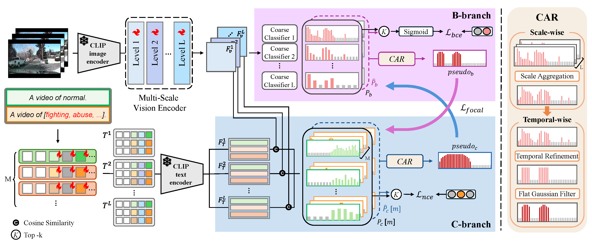

<p align="center">
<h1 align="center">
  CROSS PSEUDO LABELING FOR WEAKLY SUPERVISED VIDEO ANOMALY DETECTION
  <br />
</h1>
  <p align="center">
    Dayeon Lee* </a>&nbsp;·&nbsp;
    Donghyeong Kim*</a>&nbsp;·&nbsp;
    Chaewon Park &nbsp;·&nbsp;
    Sungmin Woo  &nbsp;·&nbsp;
    <a href="http://mvp.yonsei.ac.kr/">Sangyoun Lee</a>&nbsp;&nbsp;
  </p>
  <p align="center">
    Yonsei University, Samsung Electronics
  </p>
  <p align="center">
    <a href="https://arxiv.org/pdf/2602.17077"></a>
  </p>
  <div align="center"></div>
</p>
</p>

## Introduction

<p align="center">
  
</p>

<p align="justify">
  <strong>Abstract:</strong> Weakly supervised video anomaly detection aims to detect anomalies and identify abnormal categories with only videolevel labels. We propose CPL-VAD, a dual-branch framework with cross pseudo labeling. The binary anomaly detection branch focuses on snippet-level anomaly localization, while the category classification branch leverages vision–language alignment to recognize abnormal event categories. By exchanging pseudo labels, the two branches transfer complementary strengths, combining temporal precision with semantic discrimination. Experiments on XD-Violence and UCF-Crime demonstrate that CPL-VAD achieves state-of-the-art performance in both anomaly detection and abnormal category classification
</p>

##  News
- 2026-02-20: [[arXiv paper]](https://arxiv.org/abs/2602.17077) is available.
- 2026-03-13: test code is available.
- Our training code will be provided after the ICASSP 2026.

## Installation
Clone the repository and create an anaconda environment using.

```
git clone https://github.com/eastbrother87/CPLVAD.git
cd CPLVAD

conda create -y -n CPLVAD python=3.10
conda activate CPLVAD

pip install torch==2.4.0 torchvision==0.19.0 torchaudio==2.4.0 --index-url https://download.pytorch.org/whl/cu124
pip install -r requirements.txt
```

Download CPLVAD checkpoint at my [Hugging face](https://huggingface.co/buckets/Donghyeong/CPLVAD_weights).

```
mkdir -p ckpt
```
Download CLIP features for UCF-Crime and XD-Vioilence datasets. To set up the UCF-Crime and XD-Violence datasets, please follow the same procedure described in the [VadCLIP repository](https://github.com/nwpu-zxr/VadCLIP).


##  Inference & Evaluation

```
python test_xd.py #For XD-Violence Dataset.
python test_ucf.py #For UCF-Crime Dataset.
```

##  Acknowledgements
Our repository is built upon [VadCLIP](https://github.com/nwpu-zxr/VadCLIP), [ActionFormer](https://github.com/happyharrycn/actionformer_release). We thank to all the authors for their awesome works.

##  BibTex
The BibTeX entry will be updated with the ICASSP 2026 proceedings information soon.
```
@article{dayeon2026cross,
  title={Cross Pseudo Labeling For Weakly Supervised Video Anomaly Detection},
  author={Dayeon, Lee and Dongheyong, Kim and Chaewon, Park and Sungmin, Woo and Sangyoun, Lee},
  journal={arXiv preprint arXiv:2602.17077},
  year={2026}
}
```
